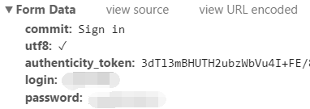

# login_libs
模拟登陆各网站的代码 - 持续更新，欢迎PR

看有人写了Request的，我整理个urllib2的登陆集合

## 使用的第三方库
* **urllib**
* **urllib2**
* **cookielib**

## github
登陆github需要post5个信息  

其中4个都是固定的，只有token需要在当前页面中动态获取。

* 代码：
[login_github.py](login_github.py)
